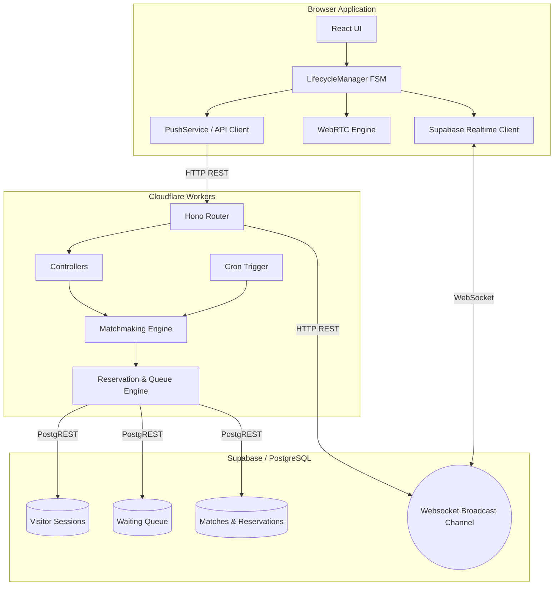

# Phase 1: Repository Architecture Map & Diagram
**Objective:** Reverse-engineer and document the entire repository structure.

## Repository Overview
The codebase is a monorepo containing four main workspaces:
- `frontend` (React + Vite)
- `backend` (Hono JS deployed on Cloudflare Workers)
- `simulator` (A custom headless test orchestrator)
- `supabase` (Database migrations and configurations)

---

## 1. Frontend Architecture
The frontend is built on React 19 and Vite, deployed at `https://kaboom-tv.com`.
- **Entry Points:** `src/main.tsx` → `src/App.tsx`.
- **Routing:** React Router v6. Core routes include `/` (LandingPage), `/chat` (ChatPage), and various static/SEO pages. Contains a `/admin` protected route sub-app.
- **State Management:** Uses React Context (`SessionContext`, `ToastContext`, `FloatingLayoutContext`) combined with a strictly enforced state machine located in `src/services/LifecycleManager.ts`.
- **WebRTC Layer:** `src/hooks/useVideoChat.ts` interfaces with `src/webrtc/index.ts` to manage local/remote media tracks, ICE servers, and peer connections.
- **Realtime Orchestration:** `src/services/realtime.ts` maps Supabase websocket events to the `LifecycleManager`.

## 2. Backend Architecture
The backend is an Edge-native API using the Hono framework, running on Cloudflare Workers (`backend/src/index.ts`).
- **Cron Jobs:** The Cloudflare worker exposes a `scheduled` event handler that periodically executes `runGlobalHealCycle` and `runGlobalMatchCycle` inside `src/matchmaking/matchingEngine.ts`.
- **Controllers & Routes:** `src/routes/index.ts` exports `/api/match`, `/api/session/heartbeat`, `/api/chat`, etc.
- **Matchmaking Engine:** 
  - `scoringEngine.ts`: Calculates weighted compatibility scores.
  - `queueEngine.ts`: Manages queue entries and wait times.
  - `reservationEngine.ts`: Handles race conditions through atomic database reservations.
- **Data Access:** Repositories abstract Supabase interactions (e.g., `sessionRepository`, `matchRepository`, `metricsRepository`).

## 3. Database Architecture (Supabase)
Uses PostgreSQL.
- **Tables:** `visitor_sessions`, `waiting_queue`, `matches`, `temporary_messages`, `likes`, `reports`, `reservations`.
- **Realtime:** Uses Supabase Realtime broadcast channels to push events like `matched`, `start_negotiation`, `sdp_offer`, `ice_candidate`, and `partner_left`.

## 4. System Flow Diagram (Mermaid)

## Adversarial Review Notes
- **Reviewer:** Is this architecture map exhaustive? 
- **Finding:** The map covers the primary topologies, but it misses explicit definitions of the `simulator` logic which is critical for the `certify:full` command. The simulator bypasses the UI and creates headless clients (`src/browserEngine.ts`). This is acceptable for a high-level architecture map, but Phase 7 (Complete Request Lifecycle) must heavily audit how the simulator accurately mimics real browsers.
- **Confidence:** High. The architecture is standard Edge API + Websocket broadcast over a relational DB.
