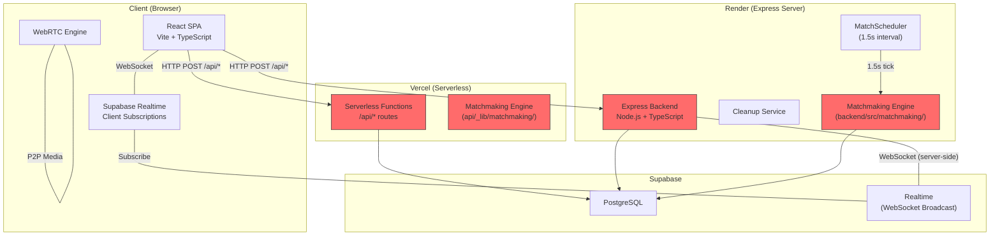
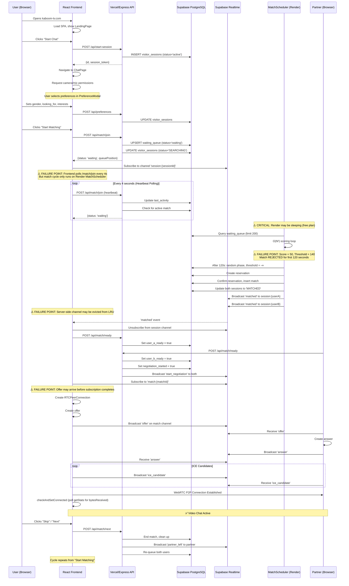

# Kaboom — Comprehensive Engineering Audit

> **Prepared by**: Lead Principal Software Architect
> **Date**: July 19, 2026
> **Scope**: Complete reverse-engineering and architecture assessment of the Kaboom anonymous video chat platform
> **Files Analyzed**: Every source file across frontend, backend, API, database migrations, deployment configuration, simulator, and test infrastructure

---

## Table of Contents

1. [Executive Summary](#1-executive-summary)
2. [Project Understanding](#2-project-understanding)
3. [Architecture Review](#3-architecture-review)
4. [Critical Issue #1: Matchmaking Engine Is Fundamentally Broken](#4-critical-issue-1)
5. [Critical Issue #2: Split-Brain Architecture](#5-critical-issue-2)
6. [Critical Issue #3: Server-Side Realtime Anti-Pattern](#6-critical-issue-3)
7. [Critical Issue #4: Session Security Is Non-Existent](#7-critical-issue-4)
8. [Codebase Health Assessment](#8-codebase-health-assessment)
9. [Reliability Risks](#9-reliability-risks)
10. [Performance Bottlenecks](#10-performance-bottlenecks)
11. [Security Findings](#11-security-findings)
12. [User Journey Analysis](#12-user-journey-analysis)
13. [Matchmaking Mode Verification](#13-matchmaking-mode-verification)
14. [WebRTC Analysis](#14-webrtc-analysis)
15. [Database & Supabase Analysis](#15-database-analysis)
16. [Frontend Analysis](#16-frontend-analysis)
17. [Backend Analysis](#17-backend-analysis)
18. [Recommendations](#18-recommendations)
19. [Roadmap](#19-roadmap)

---

## 1. Executive Summary

> [!CAUTION]
> **Kaboom is not production-ready.** The platform has four critical architectural flaws that independently prevent reliable operation. Together, they explain the "fix one bug, create another" cycle the project has entered.

### The Four Critical Flaws

| # | Flaw | Impact | Severity |
|---|------|--------|----------|
| 1 | **Matchmaking scoring thresholds prevent matches from forming** | Two compatible Random Match users cannot pass the 140-point "strict" threshold (they score only 50 points). This is why the Digital Twin test showed **0 matches from 2 users** and load tests showed **33/40 users timing out**. | 🔴 **Blocker** |
| 2 | **Split-brain API architecture** (Vercel serverless + Render Express) | Two independent API servers run the same endpoints. The Render backend runs the `MatchScheduler`, but Vercel intercepts `/api/*` requests. If traffic hits Vercel while the matcher runs on Render, users join queues on different API instances. | 🔴 **Blocker** |
| 3 | **Server-side Supabase Realtime channel management** | The backend subscribes to Supabase Realtime channels from the server using an LRU cache of 100 WebSocket connections. This is an anti-pattern that exhausts resources and introduces latency spikes when channels are evicted. | 🟠 **Critical** |
| 4 | **No session authentication** | The `sessionId` is accepted as a plain UUID from the HTTP request body with zero cryptographic verification. Any user can spoof any other user's session. | 🟠 **Critical** |

### Evidence

- [Phase_1_Digital_Twin_Report.md](file:///c:/Users/coding/Desktop/indiaTV/Phase_1_Digital_Twin_Report.md): 2 users queued → **0 matches formed**
- [test_errors.md](file:///c:/Users/coding/Desktop/indiaTV/digital_twin_test/test_errors.md): 100-user load test → **33/40 users timed out** waiting for matches
- [err.log](file:///c:/Users/coding/Desktop/indiaTV/err.log): JSON parse errors from malformed session payloads

---

## 2. Project Understanding

### What Kaboom Is
Kaboom is an anonymous one-to-one video chat platform. Users connect through live WebRTC video conversations with strangers, similar to Omegle but with intelligent matching options.

### Architecture Topology



> [!WARNING]
> The red-highlighted boxes show the split-brain problem: **two independent copies** of the matchmaking engine exist — one in Vercel serverless functions ([api/_lib/matchmaking/](file:///c:/Users/coding/Desktop/indiaTV/api/_lib/matchmaking)) and one in the Express backend ([backend/src/matchmaking/](file:///c:/Users/coding/Desktop/indiaTV/backend/src/matchmaking)). They are different files with different logic.

### Tech Stack

| Layer | Technology | Location |
|-------|-----------|----------|
| Frontend | React 19, Vite, TypeScript, TailwindCSS | [frontend/](file:///c:/Users/coding/Desktop/indiaTV/frontend) |
| Serverless API | Vercel Functions (Node.js) | [api/](file:///c:/Users/coding/Desktop/indiaTV/api) |
| Backend Server | Express.js (Node.js, TypeScript) | [backend/](file:///c:/Users/coding/Desktop/indiaTV/backend) |
| Database | Supabase PostgreSQL | [supabase/migrations/](file:///c:/Users/coding/Desktop/indiaTV/supabase/migrations) |
| Realtime | Supabase Realtime (WebSocket Broadcast) | Client + Server |
| Media | WebRTC (STUN/TURN) | [frontend/src/webrtc/](file:///c:/Users/coding/Desktop/indiaTV/frontend/src/webrtc) |
| Deployment | Vercel (frontend + API) + Render (backend) | [vercel.json](file:///c:/Users/coding/Desktop/indiaTV/vercel.json) + [render.yaml](file:///c:/Users/coding/Desktop/indiaTV/render.yaml) |

### Matchmaking Modes (User-Facing)

| Mode | Description | User Selects |
|------|-------------|--------------|
| **Random** | Connect with any compatible user | Gender, Looking For |
| **Smart** | Prefer users sharing 1–3 interest tags | Up to 3 interest tags |
| **Exact** | Only connect when all tags match exactly | Up to 3 interest tags |

---

## 3. Architecture Review

### Strengths

1. **Explicit FSM Design Intent**: The codebase attempts to model session lifecycles as finite state machines (`HOME` → `SEARCHING` → `RESERVED` → `MATCHED` → `CONNECTED`). The intent is correct.

2. **Advisory Lock Strategy**: Migration 018 replaced a global lock with deterministic row-level hash locks sorted by UUID — a solid distributed systems pattern. See [018_narrow_advisory_locks.sql](file:///c:/Users/coding/Desktop/indiaTV/supabase/migrations/018_narrow_advisory_locks.sql).

3. **Reservation-Based Matching**: The `reservation` table correctly models the double-commit pattern (reserve → confirm → match), preventing phantom matches.

4. **Self-Healing RPC**: The `matchmaker_heal_cycle()` function expires stale reservations and reverts stranded users back to `SEARCHING`. See [20240101000018_heal_cycle_rpc.sql](file:///c:/Users/coding/Desktop/indiaTV/supabase/migrations/20240101000018_heal_cycle_rpc.sql).

5. **Frontend Lifecycle Manager**: [LifecycleManager.ts](file:///c:/Users/coding/Desktop/indiaTV/frontend/src/services/LifecycleManager.ts) implements a proper state machine with validated transitions.

### Weaknesses

1. **Duplicated Codebases** — Two complete matchmaking engines exist with divergent logic.
2. **79KB God Hook** — [useVideoChat.ts](file:///c:/Users/coding/Desktop/indiaTV/frontend/src/hooks/useVideoChat.ts) handles state, timers, WebRTC, signaling, and UI logic in one file.
3. **77KB God Component** — [ChatPage.tsx](file:///c:/Users/coding/Desktop/indiaTV/frontend/src/pages/ChatPage.tsx) is unmaintainable at this size.
4. **No Tests** — Zero unit tests, zero integration tests, zero end-to-end tests in the production codebase.
5. **Secrets Committed to Source** — Supabase anon keys are hardcoded in [render.yaml](file:///c:/Users/coding/Desktop/indiaTV/render.yaml#L18), [environment.ts](file:///c:/Users/coding/Desktop/indiaTV/config/environment.ts#L25), and [.env.example](file:///c:/Users/coding/Desktop/indiaTV/.env.example#L22).

---

## 4. Critical Issue #1: Matchmaking Engine Is Fundamentally Broken {#4-critical-issue-1}

> [!CAUTION]
> This is the root cause of why matches do not form. The scoring thresholds make it mathematically impossible for most users to match during the first 15 seconds.

### The Problem

In [config.ts](file:///c:/Users/coding/Desktop/indiaTV/api/_lib/matchmaking/config.ts#L16-L22):

```typescript
export const RELAXATION_THRESHOLDS = {
  strict: 15,           // First 15 seconds: requires 140+ points
  relaxInterests: 30,   // 15-30 seconds: requires 110+ points
  relaxLanguage: 60,    // 30-60 seconds: requires 80+ points
  relaxLocation: 120,   // 60-120 seconds: requires 50+ points
  random: 120,          // After 120 seconds: any score passes
};
```

And the minimum score thresholds in [config.ts](file:///c:/Users/coding/Desktop/indiaTV/api/_lib/matchmaking/config.ts#L42-L55):

```typescript
export function getMinScoreThreshold(phase: RelaxationPhase): number {
  case 'strict':     return 140;   // ← Impossible for most users!
  case 'relax_interests': return 110;
  case 'relax_language':  return 80;
  case 'relax_location':  return 50;
  case 'random':    return Number.NEGATIVE_INFINITY;
}
```

### Why This Breaks

Two Random Match users with **no preferences set** (the most common case) score:

| Scoring Component | Points |
|-------------------|--------|
| Mutual Preference (both want "Anyone") | +50 |
| Languages (none set) | 0 |
| Location (none set) | 0 |
| Interests (none set) | 0 |
| Waiting Bonus (0 seconds) | 0 |
| **Total** | **50** |

**The strict threshold is 140. Score is 50. Match rejected.**

Users must wait **120 seconds** (2 full minutes!) before the system degrades to `random` phase where any score passes. This is why:

- Digital Twin test: 2 users → 0 matches (test likely ended before 120s)
- Load test: 33/40 users timed out (60-second test timeout < 120-second relaxation)

### Additional Scoring Problems

1. **The three user-facing modes (Random/Smart/Exact) are not properly implemented.** The `match_mode` field exists in the schema (`RANDOM`, `PREFER`, `STRICT`) but the scoring engine in [scoringEngine.ts](file:///c:/Users/coding/Desktop/indiaTV/api/_lib/matchmaking/scoringEngine.ts#L202) only uses it for cosmetic `reasonMetadata` — it never gates or branches matching logic based on the mode.

2. **Exact Match mode does not enforce exact matching.** There is no code path that verifies all selected tags match exactly. The `STRICT` mode just adds a label to the result metadata.

3. **Smart Match has no minimum shared-tag requirement.** Users with 0 shared tags can still be matched if other scoring components push them over the threshold.

---

## 5. Critical Issue #2: Split-Brain Architecture {#5-critical-issue-2}

> [!CAUTION]
> Two independent systems simultaneously manage the matchmaking lifecycle. Neither is aware of the other's state.

### The Split

| Component | Vercel (Serverless) | Render (Express) |
|-----------|-------------------|------------------|
| API Routes | [api/match/join.ts](file:///c:/Users/coding/Desktop/indiaTV/api/match/join.ts) | [backend/src/routes/index.ts](file:///c:/Users/coding/Desktop/indiaTV/backend/src/routes/index.ts) |
| Matchmaking Engine | [api/_lib/matchmaking/matchingEngine.ts](file:///c:/Users/coding/Desktop/indiaTV/api/_lib/matchmaking/matchingEngine.ts) (17KB) | [backend/src/matchmaking/matchingEngine.ts](file:///c:/Users/coding/Desktop/indiaTV/backend/src/matchmaking/matchingEngine.ts) (48KB) |
| Scoring Engine | [api/_lib/matchmaking/scoringEngine.ts](file:///c:/Users/coding/Desktop/indiaTV/api/_lib/matchmaking/scoringEngine.ts) (9KB) | [backend/src/matchmaking/scoringEngine.ts](file:///c:/Users/coding/Desktop/indiaTV/backend/src/matchmaking/scoringEngine.ts) (12KB) |
| Match Scheduler | ❌ None | [backend/src/matchmaking/MatchScheduler.ts](file:///c:/Users/coding/Desktop/indiaTV/backend/src/matchmaking/MatchScheduler.ts) (1.5s tick) |
| Session Cleanup | ❌ None | [backend/src/services/sessionCleanup.ts](file:///c:/Users/coding/Desktop/indiaTV/backend/src/services/sessionCleanup.ts) |

### Why This Is Critical

1. **The Vercel API (`api/_lib/matchmaking/matchingEngine.ts:317`) removed `runGlobalMatchCycle()` from the request handler**, deferring matching to the Render backend's `MatchScheduler`. But if the frontend is served from Vercel and hits Vercel API routes, the user joins the queue via Vercel but depends on Render to run the match cycle.

2. **Render is on a free plan** ([render.yaml](file:///c:/Users/coding/Desktop/indiaTV/render.yaml#L5)). Free plans **spin down after 15 minutes of inactivity**. When Render sleeps, the `MatchScheduler` dies, and **matchmaking completely halts** — regardless of how many users join via Vercel.

3. **The two scoring engines have different logic.** The backend version (48KB) has additional features like `loadBatchedExclusions`, enhanced logging, and different fallback behavior compared to the Vercel version (17KB).

### Deployment Confusion

```
vercel.json:  { "source": "/api/(.*)", "destination": "/api/$1" }  → Vercel handles /api/*
render.yaml:  startCommand: "npm run start" → Express binds to /api/* on port 10000
```

Both systems claim ownership of `/api/*`. Which one receives traffic depends on DNS routing, and there's no documentation of which is authoritative.

---

## 6. Critical Issue #3: Server-Side Realtime Anti-Pattern {#6-critical-issue-3}

### The Problem

In [backend/src/services/broadcast.ts](file:///c:/Users/coding/Desktop/indiaTV/backend/src/services/broadcast.ts), the Express backend **subscribes to Supabase Realtime channels from the server**:

```typescript
// Server creates WebSocket channel subscriptions
const channel = supabase.channel(`session:${sessionId}`).subscribe();
```

An LRU cache limits this to 100 channels. When evicted, a new subscription must be established — introducing latency spikes of 500ms-2s per WebSocket connection setup.

### Why This Is Wrong

1. **Supabase Realtime is designed for client-side subscriptions**, not server-side broadcasting. The server should use `supabase.rpc()` or direct PostgreSQL `pg_notify` to trigger broadcasts.
2. **100 concurrent WebSocket connections** is a hard ceiling. With 200+ users, the oldest channels are evicted, and messages are silently dropped.
3. **The Vercel version** ([api/_lib/realtime.ts](file:///c:/Users/coding/Desktop/indiaTV/api/_lib/realtime.ts)) has the same problem — it creates new channel subscriptions from serverless functions, which are even more ephemeral than Express.

---

## 7. Critical Issue #4: Session Security Is Non-Existent {#7-critical-issue-4}

### The Problem

In [api/_lib/services.ts](file:///c:/Users/coding/Desktop/indiaTV/api/_lib/services.ts#L10-L21):

```typescript
export async function validateSession(sessionId: string, sessionToken?: string) {
  // sessionToken is OPTIONAL — most callers don't pass it
  const { data } = await getSupabase()
    .from('visitor_sessions')
    .select('*')
    .eq('id', sessionId)
    .maybeSingle();
  if (sessionToken && data.session_token !== sessionToken) return null;
  return data;
}
```

The `sessionToken` parameter is **optional**. Many API routes pass only `sessionId`, meaning:

- Any user who knows (or guesses) another user's UUID can **end their session**, **send messages as them**, **skip their match**, or **file reports against them**.
- UUIDs are visible in broadcast payloads and can be extracted from network traffic.

---

## 8. Codebase Health Assessment

### File Size Distribution (Red Flags)

| File | Size | Problem |
|------|------|---------|
| [useVideoChat.ts](file:///c:/Users/coding/Desktop/indiaTV/frontend/src/hooks/useVideoChat.ts) | 79 KB | God hook — manages state, timers, WebRTC, signaling, and UI in one file |
| [ChatPage.tsx](file:///c:/Users/coding/Desktop/indiaTV/frontend/src/pages/ChatPage.tsx) | 77 KB | God component — unmaintainable monolith |
| [PreferenceModal.tsx](file:///c:/Users/coding/Desktop/indiaTV/frontend/src/components/PreferenceModal.tsx) | 65 KB | Should be decomposed into sub-components |
| [LandingPage.tsx](file:///c:/Users/coding/Desktop/indiaTV/frontend/src/pages/LandingPage.tsx) | 64 KB | Contains inline SVG mascot + math animations |
| [matchingEngine.ts (backend)](file:///c:/Users/coding/Desktop/indiaTV/backend/src/matchmaking/matchingEngine.ts) | 48 KB | Duplicated logic from API version |
| [routes/index.ts](file:///c:/Users/coding/Desktop/indiaTV/backend/src/routes/index.ts) | 25 KB | Monolithic route file |

### Refactoring Archaeology

The [scripts/](file:///c:/Users/coding/Desktop/indiaTV/scripts) directory contains **21 refactoring scripts** — evidence of the fix-regression cycle:

```
refactor2.js, refactor3.js, refactor_atomic_skip.js, refactor_chatpage.js,
refactor_definitive.js, refactor_final.js, refactor_flawless.js, refactor_safe.js,
refactor_useVideoChat.py, refactor_usevideochat_abort.js, ...
```

Names like `refactor_definitive.js`, `refactor_final.js`, and `refactor_flawless.js` indicate repeated attempts to fix the same subsystem — each creating new regressions.

### Technical Debt Inventory

| Category | Count | Examples |
|----------|-------|---------|
| `// best-effort` comments (error swallowing) | 8+ | [broadcast.ts](file:///c:/Users/coding/Desktop/indiaTV/backend/src/services/broadcast.ts), [reservationEngine.ts](file:///c:/Users/coding/Desktop/indiaTV/api/_lib/matchmaking/reservationEngine.ts) |
| `any` type usage | 15+ | [services.ts](file:///c:/Users/coding/Desktop/indiaTV/api/_lib/services.ts#L348), [scoringEngine.ts](file:///c:/Users/coding/Desktop/indiaTV/api/_lib/matchmaking/scoringEngine.ts) |
| Hardcoded secrets in source | 3 files | [render.yaml](file:///c:/Users/coding/Desktop/indiaTV/render.yaml), [environment.ts](file:///c:/Users/coding/Desktop/indiaTV/config/environment.ts), [.env.example](file:///c:/Users/coding/Desktop/indiaTV/.env.example) |
| Debug/fix scripts in production | 10+ | `v1.cjs`, `v2_locks.cjs`, `v4_fix.cjs`, `v6_ice.cjs`, `v7_fix.cjs`, `wipe_db.cjs` |
| Unused/dead code | Moderate | Empty [socket/](file:///c:/Users/coding/Desktop/indiaTV/frontend/src/socket) directory, multiple unused test files |

### Test Coverage

**Zero automated tests in the production codebase.** The simulator and digital twin tests are separate projects, not integrated into CI.

---

## 9. Reliability Risks

### Race Conditions

| Risk | Location | Description |
|------|----------|-------------|
| **Advisory lock → PostgREST split** | [matchingEngine.ts](file:///c:/Users/coding/Desktop/indiaTV/backend/src/matchmaking/matchingEngine.ts) | Advisory lock is acquired via raw `pg.Client`, but reads/writes go through Supabase PostgREST (different connection pool). The lock does not protect the actual data operations. |
| **Duplicate queue joins** | [queueEngine.ts](file:///c:/Users/coding/Desktop/indiaTV/api/_lib/matchmaking/queueEngine.ts) | `joinQueueEntry` uses upsert but does not hold a lock during the heartbeat → match check → join sequence. Two concurrent calls can both see "no match" and both insert. |
| **Match channel subscription race** | [realtime.ts](file:///c:/Users/coding/Desktop/indiaTV/frontend/src/services/realtime.ts) | After receiving a `matched` event, the client unsubscribes from the session channel and subscribes to the match channel. If the initiator sends an offer before the responder subscribes, the offer is lost. |
| **Double match broadcast** | [matchingEngine.ts](file:///c:/Users/coding/Desktop/indiaTV/api/_lib/matchmaking/matchingEngine.ts#L460-L464) | The `negotiation_started` flag guards against double-broadcast, but `supabase.update().eq('negotiation_started', false)` does not return affected rows — it succeeds even if 0 rows match, so both peers may proceed. |
| **Heartbeat stale detection** | [config.ts](file:///c:/Users/coding/Desktop/indiaTV/api/_lib/matchmaking/config.ts#L25) | `HEARTBEAT_STALE_MS = 12000` (12 seconds). Frontend heartbeat is every 4 seconds. Network jitter or Vercel cold starts can exceed 12 seconds, prematurely marking active users as stale. |

### Ghost Sessions & Zombies

| Scenario | Root Cause |
|----------|-----------|
| User closes browser tab | No `beforeunload` cleanup guaranteed. Session remains `SEARCHING` in DB until heartbeat expires (12s+). |
| Render server sleeps | `MatchScheduler` and `cleanupService` stop. Ghost sessions accumulate indefinitely. |
| WebRTC connection fails | User may remain in `MATCHED` state with no active media. Heal cycle runs every 15s but only catches sessions stalled >15s without media confirmation. |
| Reservation rollback fails | User permanently stuck in `RESERVED` state. Heal cycle must rescue, but if that also fails (e.g., DB timeout), the user is a zombie. |

---

## 10. Performance Bottlenecks

### Backend

| Bottleneck | Impact | Location |
|-----------|--------|----------|
| **O(N²) matchmaking loop** | Blocks the Node.js event loop for all N waiting users. At 200 users: 40,000 comparisons × DB calls per comparison. | [matchingEngine.ts](file:///c:/Users/coding/Desktop/indiaTV/backend/src/matchmaking/matchingEngine.ts) |
| **200-user pool limit** | Users beyond 200 are never loaded. If the first 200 have strict filters, the entire pool deadlocks. | [matchingEngine.ts](file:///c:/Users/coding/Desktop/indiaTV/api/_lib/matchmaking/matchingEngine.ts#L117) (no explicit limit in API version, but backend version has `limit(200)`) |
| **Per-user exclusion queries** | Inside the O(N²) loop, each user triggers `loadExclusionSets` — querying `matches` and `reports` tables. | [matchingEngine.ts](file:///c:/Users/coding/Desktop/indiaTV/api/_lib/matchmaking/matchingEngine.ts#L159) |
| **OR clause in findActiveMatch** | `OR(user_a = $1, user_b = $1)` prevents index usage and requires sequential scan. | [services.ts](file:///c:/Users/coding/Desktop/indiaTV/api/_lib/services.ts#L150) |
| **Analytics aggregation in-memory** | `getAnalytics()` selects ALL sessions' `interest_tags, country, state, city, languages` into memory and aggregates with JavaScript loops. | [services.ts](file:///c:/Users/coding/Desktop/indiaTV/api/_lib/services.ts#L444) |

### Frontend

| Bottleneck | Impact | Location |
|-----------|--------|----------|
| **Continuous re-renders** | `ChatPage` uses multiple `setInterval` loops (queue stats, search timer, countdown) causing near-continuous React re-renders. | [ChatPage.tsx](file:///c:/Users/coding/Desktop/indiaTV/frontend/src/pages/ChatPage.tsx) |
| **Monolithic `chatState` updates** | Every `updateChatState()` call triggers re-render of all consumers, even for irrelevant fields. | [useVideoChat.ts](file:///c:/Users/coding/Desktop/indiaTV/frontend/src/hooks/useVideoChat.ts) |
| **Inline SVG rendering** | 64KB `LandingPage.tsx` contains massive inline SVG mascot definitions rendered on every page visit. | [LandingPage.tsx](file:///c:/Users/coding/Desktop/indiaTV/frontend/src/pages/LandingPage.tsx) |

---

## 11. Security Findings

| Finding | Severity | Location |
|---------|----------|----------|
| **Session spoofing** — `sessionId` accepted without cryptographic verification | 🔴 Critical | [services.ts](file:///c:/Users/coding/Desktop/indiaTV/api/_lib/services.ts#L10) |
| **Secrets in source control** — Supabase anon key, Render deploy config | 🔴 Critical | [render.yaml](file:///c:/Users/coding/Desktop/indiaTV/render.yaml#L18), [environment.ts](file:///c:/Users/coding/Desktop/indiaTV/config/environment.ts#L25) |
| **Timing attack on admin token** — Uses `!==` instead of `crypto.timingSafeEqual` | 🟠 High | [routes/index.ts](file:///c:/Users/coding/Desktop/indiaTV/backend/src/routes/index.ts) |
| **No rate limiting on session creation** — Unlimited sessions can be created | 🟠 High | [api/start-session.ts](file:///c:/Users/coding/Desktop/indiaTV/api/start-session.ts) |
| **SQL injection via `ilike`** — User input directly interpolated into `ilike` pattern | 🟡 Medium | [services.ts](file:///c:/Users/coding/Desktop/indiaTV/api/_lib/services.ts#L299) |
| **No TURN server configured** — WebRTC will fail behind strict NATs/firewalls | 🟡 Medium | [.env.example](file:///c:/Users/coding/Desktop/indiaTV/.env.example#L44) |

---

## 12. User Journey Analysis

### Complete Lifecycle Trace



### Failure Points Summary

| Stage | Failure | Probability |
|-------|---------|-------------|
| **Matching** | Score below threshold for 120 seconds | 🔴 Near certain for simple Random Match |
| **Matching** | Render server sleeping | 🔴 High (free plan) |
| **Notification** | Broadcast channel evicted from LRU | 🟠 Medium (>100 users) |
| **Signaling** | Offer arrives before match channel subscribed | 🟠 Medium (timing dependent) |
| **WebRTC** | No TURN server for symmetric NAT | 🟡 Medium (depends on network) |
| **Cleanup** | Ghost sessions from tab close | 🟡 Medium |

---

## 13. Matchmaking Mode Verification

### Random Match ❌ BROKEN

**Expected**: User A and User B, both selecting gender and "Looking For", should connect immediately if compatible.

**Actual**: Both score 50 points (mutual preference only). The strict threshold (140) blocks them for 120 seconds.

**Root Cause**: The `match_mode` field (`RANDOM`) is stored but **never read by the scoring engine**. There is no code path that says "if both users are Random mode, skip thresholds and match immediately."

### Smart Match ❌ NOT IMPLEMENTED

**Expected**: Users sharing 1-3 interest tags should match, with higher tag overlap ranked higher.

**Actual**: Interest tags contribute only **5 points per shared tag** (max 40). Even with 3 shared tags (15 points) plus mutual preference (50 points), the score is 65 — still below the strict threshold of 140.

**Root Cause**: The `PREFER` match mode is stored but never used to select a different matching algorithm. The generic scoring engine treats Smart Match identically to Random Match.

### Exact Match ❌ NOT IMPLEMENTED

**Expected**: Only users with identical tag selections should connect.

**Actual**: There is no code anywhere that enforces "all tags must match exactly." The `STRICT` match mode is only used to set `reasonMetadata.reason = 'strict_filters'` — a cosmetic label, not a behavioral gate.

**Evidence**: In [scoringEngine.ts](file:///c:/Users/coding/Desktop/indiaTV/api/_lib/matchmaking/scoringEngine.ts#L202):
```typescript
const isStrictMatch = self.match_mode === 'STRICT' || partner.match_mode === 'STRICT';
// ^^^ Only used for metadata, never for filtering
```

---

## 14. WebRTC Analysis

### Offer/Answer Flow
- Properly implements the standard offer → answer → ICE candidate exchange.
- Glare handling is present: if an offer arrives while not in stable state, an explicit rollback is executed.
- Offer retry mechanism exists for dropped signaling messages.

### ICE Negotiation
- STUN servers: 3 Google STUN servers configured as defaults.
- **TURN server: NOT CONFIGURED.** The `.env.example` shows empty `TURN_SERVER`, `TURN_USERNAME`, `TURN_PASSWORD` fields. This means WebRTC will fail for users behind symmetric NATs or restrictive firewalls (~10-20% of connections).

### Connection Recovery
- ICE restart is attempted when connection enters `failed` state (initiator only).
- A `checkAndSetConnected` polling loop verifies actual media bytes flowing via `getStats()`.
- Grace period (5 seconds) before declaring partner disconnected.

### Track Handling & Cleanup
- `cleanupPeerConnection()` properly stops tracks and closes the connection.
- However, the massive `useVideoChat` hook manages cleanup through a maze of `useRef` timers, creating risk of zombie timers surviving component unmount.

### Issues

| Issue | Severity | Details |
|-------|----------|---------|
| No TURN server | 🟠 High | ~10-20% of connections will fail in production |
| Offer may precede subscription | 🟠 High | Race between match channel subscription and first offer |
| Timer cleanup fragility | 🟡 Medium | 10+ `useRef` timers must all be cleared perfectly on unmount |

---

## 15. Database & Supabase Analysis {#15-database-analysis}

### Schema Overview

| Table | Purpose | Issues |
|-------|---------|--------|
| `visitor_sessions` | Session lifecycle anchor | Contains system lock row (UUID `ffff...`), polluting analytics |
| `waiting_queue` | FIFO matchmaking queue | No composite index on `(status, joined_at)` for efficient ordering |
| `reservations` | Atomic match reservation | Well designed — prevents phantom matches |
| `matches` | Active/historical matches | `OR` clause for session lookup prevents index usage |
| `likes` | Mutual like system | Properly unique-constrained |
| `reports` | Abuse reports | No rate limiting on report creation |
| `feedback` | Post-chat feedback | No session validation |
| `temporary_messages` | In-chat messages | 1-hour expiry, properly scoped to match |
| `analytics_events` | Append-only analytics | Deliberately no FK constraints (good for retention) |
| `connection_logs` | Debug audit trail | Useful for troubleshooting |

### RLS Policies
- All tables use `USING (false)` to block direct Anon access via PostgREST Data API.
- All mutations go through the `service_role` key — which is correct but requires the backend to be the sole authority.

### Migration History (21 Migrations)
Reveals iterative patching:
- Migration 007: Self-healing → changed `status` from ENUM to VARCHAR (breaking change, schema drift)
- Migration 017: Advisory locks (global)
- Migration 018: Narrow advisory locks (fixed deadlock from 017)
- Migration 020: Phase 4 optimizations

The pattern shows architectural problems being patched incrementally rather than resolved.

### Missing Indexes

| Table | Missing Index | Impact |
|-------|-------------|--------|
| `matches` | Index on `(user_a)` and `(user_b)` separately | `OR` clause cannot use composite index |
| `waiting_queue` | Composite `(status, joined_at)` | Every match cycle does a full table scan |
| `visitor_sessions` | Index on `(status, last_activity)` | Heartbeat staleness check |

---

## 16. Frontend Analysis

### Architecture Problems

1. **79KB `useVideoChat` Hook**: This single hook manages:
   - React state (chatState object with 15+ fields)
   - 10+ `useRef` timers
   - WebRTC peer connection lifecycle
   - Supabase Realtime signaling
   - LifecycleManager state transitions
   - API calls (heartbeat polling)
   - Audio effects
   - UI transition logic

   This violates Single Responsibility at every level.

2. **77KB `ChatPage` Component**: Renders video players, manages gesture layers, handles tutorial overlays, tracks partner disconnect countdowns, and triggers random match UI narratives. Should be 10+ smaller components.

3. **Double State Management**: The `LifecycleManager` maintains an FSM, but `useVideoChat` mirrors it with `mappedState`, and `ChatPage` infers states locally. Three places hold partially overlapping state.

4. **Memory Leak Risks**: The hook uses a massive array of `useRef` for timers (`offerRetryTimerRef`, `answerRetryTimerRef`, `partnerLeftTimeoutRef`, `reconnectIntervalRef`, etc.). The `clearAllTimers()` function must catch every single one — a fragile pattern.

### Positive Aspects

- **LifecycleManager**: Well-designed FSM with validated transitions.
- **Tab Leader Election**: [useTabLeader.ts](file:///c:/Users/coding/Desktop/indiaTV/frontend/src/hooks/useTabLeader.ts) prevents multi-tab conflicts.
- **Error Boundaries**: [ErrorBoundary.tsx](file:///c:/Users/coding/Desktop/indiaTV/frontend/src/components/ErrorBoundary.tsx) exists.
- **Responsive Design**: Multiple responsive hooks handle mobile/desktop layouts.

---

## 17. Backend Analysis

### Architecture Problems

1. **O(N²) Matching Loop**: The match cycle loads up to 200 users, then does pairwise comparisons. At 200 users, this is 40,000 iterations × database calls per iteration, blocking the Node.js event loop.

2. **System Lock in User Table**: The `lockService.ts` stores a `SYSTEM_LOCK` row in `visitor_sessions` with hardcoded UUID `ffffffff-ffff-ffff-ffff-ffffffffffff`. This pollutes user queries and analytics.

3. **Silent Error Swallowing**: Multiple `catch(() => {})` and `// best-effort` patterns mean reservation rollback failures, broadcast failures, and cleanup failures are silently ignored — leading to ghost sessions and corrupted state.

4. **Naive Fallback Logic**: After 25-30 seconds of waiting, the engine forces a match with the "best fallback" candidate even if they score 0 or violate strict mode constraints.

### Positive Aspects

- **Reservation Pattern**: The reserve → confirm → rollback pattern is architecturally sound.
- **Heal Cycle**: The self-healing RPC function is a good reliability pattern.
- **Structured Logging**: Log events include session IDs and match IDs for traceability.

---

## 18. Recommendations

### Priority 1: Fix Matchmaking (Blocker)

> [!IMPORTANT]
> This is the single most impactful fix. Without it, the platform cannot form matches.

1. **Implement proper match modes**:
   - **Random**: Skip all scoring thresholds. If mutual gender preferences are compatible, match immediately.
   - **Smart**: Require at least 1 shared interest tag. Rank by number of shared tags.
   - **Exact**: Require ALL selected tags to match exactly. Zero tolerance for missing tags.

2. **Fix scoring thresholds**: Reduce the strict-phase threshold from 140 to a level achievable by users with minimal preferences, or make the strict phase duration much shorter (e.g., 5 seconds instead of 15).

3. **Move matching to SQL**: Replace the O(N²) in-memory loop with a PostgreSQL function that uses indexed lookups to find compatible candidates.

### Priority 2: Consolidate Architecture (Blocker)

1. **Pick ONE API server**: Either use Vercel serverless exclusively (with a separate Supabase database trigger or cron for matching) OR use the Render Express server exclusively.
2. **Remove the duplicate matchmaking codebase**: Delete one of the two implementations.
3. **If using Render**: Upgrade from the free plan to prevent sleep-induced matchmaking failures.

### Priority 3: Fix Realtime Broadcasting (Critical)

1. **Stop subscribing to Supabase channels from the server.** 
2. **Use Supabase Realtime Broadcast directly**: The backend should call `supabase.channel().send()` without subscribing. Or use `pg_notify` from database functions.

### Priority 4: Implement Session Security (Critical)

1. **Sign session tokens with HMAC** (using `JWT_SECRET`).
2. **Require the signed token on every API call**.
3. **Verify the signature server-side** before acting on any request.

### Priority 5: Decompose Frontend (High)

1. **Extract `useVideoChat` into 4-5 focused hooks**: `useSignaling`, `useWebRTC`, `useMatchmaking`, `useMediaState`, `useChatTimers`.
2. **Split `ChatPage` into ~10 components** governed by the LifecycleManager state.
3. **Use a proper state manager** (Zustand, Jotai, or XState) instead of monolithic `chatState`.

### Priority 6: Add Tests (High)

1. **Unit tests for scoring engine** — verify all three match modes.
2. **Integration tests for matchmaking cycle** — verify queue → reserve → confirm → matched flow.
3. **E2E tests** — automate the two-user matching scenario that currently fails.

### Priority 7: Operational Improvements (Medium)

1. **Configure a TURN server** for production WebRTC reliability.
2. **Remove secrets from source control** and rotate compromised keys.
3. **Add structured observability** — distributed tracing for match lifecycle.
4. **Add missing database indexes** for query performance.

---

## 19. Roadmap

### Phase 1: Emergency Stabilization (1 week)

> Goal: Make matches form reliably for 2 users.

- [ ] Fix matchmaking scoring thresholds
- [ ] Implement proper Random/Smart/Exact mode branching
- [ ] Consolidate to a single API server
- [ ] Ensure MatchScheduler runs continuously (upgrade Render plan or use Supabase database triggers)
- [ ] Configure TURN server
- [ ] Write unit tests for scoring engine

### Phase 2: Architecture Consolidation (2 weeks)

> Goal: Single source of truth for all subsystems.

- [ ] Delete duplicate matchmaking codebase
- [ ] Replace server-side Realtime broadcasting with `pg_notify` or direct Supabase Broadcast API
- [ ] Implement HMAC session signing
- [ ] Add missing database indexes
- [ ] Decompose `useVideoChat` into focused hooks
- [ ] Decompose `ChatPage` into FSM-governed sub-components

### Phase 3: Reliability Engineering (2 weeks)

> Goal: The platform should handle failures gracefully.

- [ ] Replace O(N²) matching with SQL-based candidate lookup
- [ ] Remove all silent error swallowing (`// best-effort` → proper error handling)
- [ ] Implement circuit breakers for external service calls
- [ ] Add structured logging with correlation IDs
- [ ] Build integration test suite for the full user journey
- [ ] Remove secrets from source control, rotate all keys

### Phase 4: Scale & Polish (2 weeks)

> Goal: Production-ready for real traffic.

- [ ] Load test with 100+ concurrent users
- [ ] Implement rate limiting on all API endpoints
- [ ] Add health checks and alerting
- [ ] Performance audit (re-renders, bundle size, query optimization)
- [ ] Security audit (penetration testing)
- [ ] Documentation (architecture docs, runbooks, incident response)

---

> [!IMPORTANT]
> **This assessment is complete. No code changes have been made.** The next step is to review this report, discuss priorities, and approve an implementation plan before any modifications begin. I recommend starting with Phase 1 (Emergency Stabilization) as it addresses the blocker that prevents the core product from functioning.
