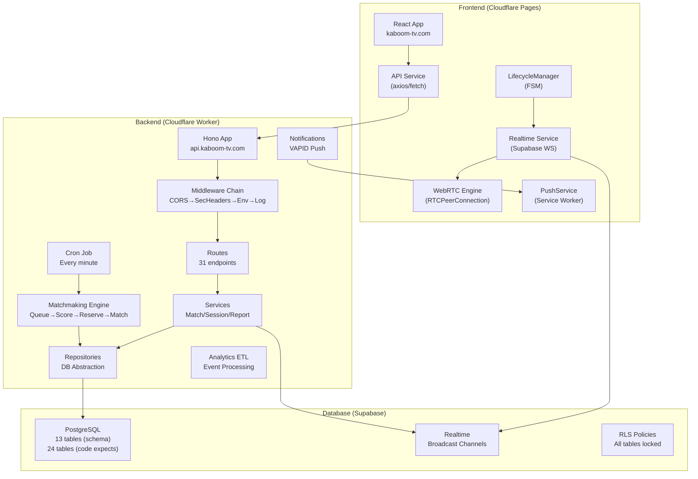

# PHASE 1 — Complete Architecture Discovery

## Status: ✅ COMPLETE

---

## System Overview

Kaboom is an anonymous random video chat platform built on:
- **Frontend**: React 19 + Vite + TypeScript + Tailwind CSS → deployed to **Cloudflare Pages** (`kaboom-tv.com`)
- **Backend**: Hono framework on **Cloudflare Workers** (`api.kaboom-tv.com`, project: `indiatv-backend`)
- **Database**: **Supabase** (PostgreSQL + Realtime)
- **Realtime**: Supabase Realtime channels (signaling, state broadcasts)
- **WebRTC**: Browser-native RTCPeerConnection with STUN/TURN

---

## Architecture Diagram



---

## Subsystem Map

### Frontend Subsystems

| Subsystem | Owner File(s) | Purpose |
|-----------|--------------|---------|
| App Shell | `App.tsx`, `main.tsx` | Routing, providers, session cleanup on unload |
| Session Management | `SessionContext.tsx` | Start/end/restore sessions, heartbeat, stats polling |
| Lifecycle FSM | `LifecycleManager.ts` | State machine: HOME→QUEUEING→MATCH_FOUND→NEGOTIATING→CONNECTED→TEARDOWN |
| WebRTC | `hooks/useVideoChat.ts` | PeerConnection, media tracks, ICE, offer/answer |
| Realtime | `services/realtime.ts` | Supabase channel subscriptions for signaling |
| REST API | `services/api.ts` | 25+ API calls via axios with interceptors |
| Push Notifications | `services/PushService.ts` | Service worker registration, VAPID subscription |
| UI Components | `components/*` (37 files) | Video players, chat, queue cards, modals, controls |
| Admin Panel | `admin/*` | Dashboard, analytics, notifications management |
| SEO | `pages/ContentHub*`, `DynamicSeo*` | Content pages for search engines |

### Backend Subsystems

| Subsystem | Owner File(s) | Purpose |
|-----------|--------------|---------|
| HTTP Layer | `index.ts`, `routes/*` | 31 Hono endpoints with middleware chain |
| Controllers | `controllers/index.ts` | Thin request handlers |
| Services | `services/index.ts`, `matchService.ts` | Business logic |
| Repositories | `database/repositories/index.ts` | Supabase query abstraction |
| DB Client | `database/client.ts` | Singleton Supabase client via AsyncLocalStorage |
| Matchmaking | `matchmaking/*.ts` | Queue→Score→Reserve→Match pipeline |
| Notifications | `notifications/*.ts` | VAPID push campaign engine |
| Analytics | `analytics/*.ts` | ETL from raw events to dashboard tables |
| Cron | `index.ts` scheduled handler | Every-minute match cycle + heal cycle |
| Broadcast | `services/broadcast.ts` | Supabase Realtime channel messaging |

---

## Data Flow

### Session Lifecycle
```
User opens kaboom-tv.com
  → SessionContext checks localStorage for existing session
  → If none: POST /api/start-session → creates visitor_sessions row
  → If exists: POST /api/restore-session → validates + returns active match
  → Heartbeat interval: POST /api/session/heartbeat (sync guardrail)
  → On close: sendBeacon POST /api/session/cleanup
```

### Match Lifecycle
```
User clicks "Start Journey"
  → POST /api/preferences (saves to visitor_sessions + user_preferences_cache)
  → POST /api/match/join (sets status=SEARCHING, inserts waiting_queue)
  → Cron job runs matchingEngine every 60s:
    → queueEngine loads waiting users
    → scoringEngine computes compatibility scores
    → reservationEngine atomically reserves pair (RPC or fallback insert)
    → matchRepository.create() inserts match row
    → broadcastToSession() notifies both users via Realtime
  → Frontend receives 'matched' event
    → LifecycleManager transitions to MATCH_FOUND → NEGOTIATING
    → WebRTC offer/answer exchanged via Supabase Realtime channels
    → POST /api/match/ready, POST /api/match/connected
  → User clicks Next:
    → POST /api/match/next → ends match, re-queues user
  → User disconnects:
    → POST /api/match/disconnect → notifies partner
    → Session cleanup runs
```

---

## Complete Table Reference Map

### Tables the Backend Code References (24 total)

| # | Table | In Schema? | Critical Endpoints |
|---|-------|-----------|-------------------|
| 1 | `visitor_sessions` | ✅ | start-session, preferences, heartbeat, matchmaking |
| 2 | `waiting_queue` | ✅ | match/join, stats, matchmaking |
| 3 | `matches` | ✅ (missing columns) | match creation, like, chat, heartbeat |
| 4 | `reservations` | ✅ (wrong columns) | reservation engine |
| 5 | `temporary_messages` | ✅ (wrong columns) | chat send/receive |
| 6 | `reports` | ✅ | report submission |
| 7 | `feedback` | ✅ | feedback submission |
| 8 | `server_metrics` | ✅ | stats recording |
| 9 | `connection_logs` | ✅ | event logging |
| 10 | `push_subscriptions` | ✅ | notification subscribe |
| 11 | `user_preferences_cache` | ✅ | preferences caching |
| 12 | `analytics_events` | ✅ (missing columns) | event logging, ETL |
| 13 | `dashboard_summary` | ✅ (wrong schema) | ETL aggregation |
| 14 | `likes` | ❌ MISSING | like action |
| 15 | `locations` | ❌ MISSING | location autocomplete |
| 16 | `interests` | ❌ MISSING | interest autocomplete |
| 17 | `matchmaker_metrics` | ❌ MISSING | metrics flush/read |
| 18 | `analytics_sync_state` | ❌ MISSING | ETL checkpoint |
| 19 | `dashboard_hourly` | ❌ MISSING | ETL aggregation |
| 20 | `dashboard_daily` | ❌ MISSING | ETL aggregation |
| 21 | `dashboard_rankings` | ❌ MISSING | ETL aggregation |
| 22 | `dashboard_match_analytics` | ❌ MISSING | ETL aggregation |
| 23 | `dashboard_activity` | ❌ MISSING | activity feed |
| 24 | `dashboard_notifications` | ❌ MISSING | notification analytics |

### Missing RPCs (3 total)

| # | RPC Name | Called From |
|---|----------|------------|
| 1 | `matchmaker_create_reservation` | `reservationEngine.ts` |
| 2 | `matchmaker_heal_cycle` | `matchingEngine.ts` |
| 3 | `update_matchmaker_metrics` | `repositories/index.ts` |

---

## Review Gate Answers

### Do I understand every subsystem?
**YES.** All subsystems documented: Frontend (10), Backend (10), Infrastructure (3).

### Is anything still unclear?
**NO.** The architecture is fully mapped. The root cause of all failures is clear: schema-code divergence.

### Have I mapped every dependency?
**YES.** Module dependency graph complete. All 24 table references, 3 RPC references, and all column references documented.

### Have I identified every request path?
**YES.** 25 frontend API calls → 31 backend endpoints → 24 database tables. All mapped.

---

## Phase 1 Completion Report

| Item | Status |
|------|--------|
| **Summary** | Full architecture discovery of Frontend, Backend, Infrastructure, and Database completed |
| **Findings** | 11 missing tables, 12+ missing columns, 3 missing RPCs, permission denied on schema |
| **Root Causes** | `kaboom_final_schema.sql` was a simplified rewrite that stripped tables/columns the backend still depends on |
| **Files Reviewed** | Every file in `frontend/src/`, `backend/src/`, `.github/workflows/`, both schema files |
| **Files Modified** | NONE (discovery phase only) |
| **Risks** | None (no modifications made) |
| **Validation** | Three independent analyst agents confirmed findings |
| **Result** | **✅ PASS** |

> [!IMPORTANT]
> Phase 1 is COMPLETE. The architecture is fully understood. Ready to proceed to Phase 2.
